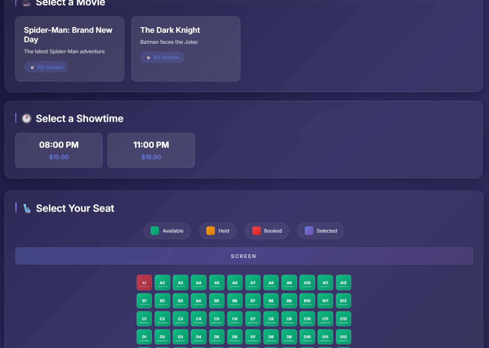

# CinemaSeat

CinemaSeat is a movie ticket booking system built for high-demand showtimes where many users may try to reserve the same seat at the same time.

The core goal is simple:

> Never sell the same seat twice.

## Live Demo

- **Frontend**: [cinemaseat.onrender.com/frontend](https://cinemaseat.onrender.com/frontend)
- **Health Check**: [cinemaseat.onrender.com/health](https://cinemaseat.onrender.com/health)

## Frontend Screenshots

Replace these placeholders with screenshots from the deployed frontend.




## Tech Stack

- **Backend**: FastAPI, Python
- **Database**: PostgreSQL
- **ORM**: SQLAlchemy
- **Payment Gateway**: `asifmahmoud414/mock-gateway:latest`
- **Containerization**: Docker, Docker Compose
- **CI**: GitHub Actions
- **Deployment**: Render

## What Works

- Movie listing
- Showtime listing
- Live seat map
- Temporary seat hold
- Hold expiry using `HOLD_TTL_SECONDS`
- Payment initiation through the provided gateway
- Gateway callback handling
- Duplicate callback handling
- Race callback handling using `booking_ref`
- Docker Compose local startup
- Render deployment

## Quick Start

### Prerequisites

- Docker
- Docker Compose

### Run Locally

```bash
docker compose up --build
```

The services will be available at:

- API: `http://localhost:8000`
- Frontend: `http://localhost:8000/frontend`
- Gateway: `http://localhost:9000`

The app seeds sample movies, showtimes, theatres, and seats during startup.

### Health Check

```bash
curl http://localhost:8000/health
```

Expected response:

```json
{
  "status": "healthy",
  "timestamp": "..."
}
```

The health endpoint returns without calling the gateway, so it stays fast even if the gateway is unavailable.

## Environment Variables

| Variable              | Purpose                                     | Default / Example                                     |
| --------------------- | ------------------------------------------- | ----------------------------------------------------- |
| `DATABASE_URL`      | PostgreSQL connection string                | `postgresql://postgres:postgres@db:5432/cinemaseat` |
| `GATEWAY_URL`       | Mock gateway base URL                       | `http://gateway:9000`                               |
| `HOLD_TTL_SECONDS`  | Seat hold duration                          | `300`                                               |
| `MOCK_PAYMENT`      | Optional local mock payment mode            | `false`                                             |
| `GATEWAY_TEST_MODE` | Sends deterministic gateway header when set | `deterministic`                                     |
| `TEST_RETRY_LOGIC`  | Callback retry testing flag                 | `false`                                             |

Example short hold expiry run:

```bash
HOLD_TTL_SECONDS=3 docker compose up --build
```

## Judging Endpoints

### Fetch Seat Map

```http
GET /seats/{showtime_id}
```

Example:

```bash
curl http://localhost:8000/seats/1
```

Response shape:

```json
{
  "showtime_id": 1,
  "movie_title": "Spider-Man: Brand New Day",
  "start_time": "2026-08-09T20:00:00",
  "seats": [
    {
      "id": 1,
      "showtime_id": 1,
      "row_letter": "A",
      "seat_number": 1,
      "status": "available",
      "price": 15.0
    }
  ]
}
```

### Hold a Seat

```http
POST /seats/{showtime_id}/hold
Content-Type: application/json
```

Example:

```bash
curl -X POST http://localhost:8000/seats/1/hold \
  -H "Content-Type: application/json" \
  -d '{
    "seat_id": 1,
    "user_identifier": "user_1"
  }'
```

Success response:

```json
{
  "hold_id": 1,
  "seat_id": 1,
  "row_letter": "A",
  "seat_number": 1,
  "hold_expires_at": "2026-08-08T10:05:00",
  "status": "held"
}
```

If the seat is already held or booked:

```http
409 Conflict
```

## Other API Endpoints

| Method   | Endpoint                         | Purpose                    |
| -------- | -------------------------------- | -------------------------- |
| `GET`  | `/health`                      | Health check               |
| `GET`  | `/movies`                      | List movies                |
| `GET`  | `/movies/{movie_id}/showtimes` | List showtimes for a movie |
| `GET`  | `/seats/{showtime_id}`         | Fetch seat map             |
| `POST` | `/seats/{showtime_id}/hold`    | Hold a seat                |
| `POST` | `/bookings/{hold_id}/pay`      | Start payment              |
| `POST` | `/bookings/callback`           | Gateway callback           |
| `GET`  | `/bookings/{booking_id}`       | Fetch booking status       |
| `GET`  | `/frontend`                    | Minimal frontend           |

## Payment Flow

`POST /bookings/{hold_id}/pay` creates a pending booking and returns `202 Accepted` quickly. The gateway charge runs in the background, and the final booking state is updated through `/bookings/callback`.

Example request:

```bash
curl -X POST http://localhost:8000/bookings/1/pay \
  -H "Content-Type: application/json" \
  -d '{
    "hold_id": 1,
    "phone": "01700000000",
    "callback_url": "http://app:8000/bookings/callback"
  }'
```

Example response:

```json
{
  "booking_id": 1,
  "payment_id": null,
  "status": "pending",
  "message": "Payment accepted. Gateway charge is running in the background."
}
```

The callback handler is idempotent:

- Duplicate callbacks return `200`
- Already processed bookings are not confirmed twice
- Failed payments release the seat
- Race callbacks can be matched using `booking_ref`

## Concurrency Strategy

CinemaSeat uses PostgreSQL row-level locking for seat holds.

When a user tries to hold a seat, the backend locks the target seat row, checks whether it is available, creates a hold, and updates the seat status in the same transaction. Concurrent requests for the same seat are serialized by PostgreSQL.

Expected behavior under contention:

```text
100 users request the same seat
1 request succeeds
99 requests receive 409 Conflict
0 oversell
```

## Verified Proof

These checks were run against the Docker/PostgreSQL stack.

### Scenario A: One Seat, Many Buyers

```text
100 concurrent hold requests for the same seat
Successful holds: 1
Rejected holds: 99
Other errors: 0
Oversell count: 0
Final seat status: held
```

### Scenario B: Abandoned Hold

Run with short TTL:

```bash
HOLD_TTL_SECONDS=3 docker compose up --build
```

Observed result:

```text
First user holds seat: 201 Created
Seat status immediately after hold: held
Seat status after TTL: available
Second user holds same seat: 201 Created
```

## Architecture

```text
Browser / Frontend
        |
        v
FastAPI Application
        |
        |-- Movies
        |-- Showtimes
        |-- Seat Map
        |-- Seat Hold
        |-- Booking / Payment
        |-- Gateway Callback
        |
        v
PostgreSQL

FastAPI Application
        |
        v
Mock Payment Gateway
```

The project intentionally uses a monolithic backend. For the hackathon timebox, this keeps deployment, debugging, and database transactions simpler than a microservice design.

## Project Structure

```text
cinemaseat/
|-- app/
|   |-- main.py
|   |-- models.py
|   |-- schemas.py
|   |-- database.py
|   |-- tasks.py
|   `-- routers/
|-- static/
|   `-- index.html
|-- tests/
|-- docker/
|   `-- Dockerfile
|-- docker-compose.yml
|-- requirements.txt
|-- ARCHITECTURE.md
|-- DECISIONS.md
`-- DEPLOYMENT.md
```

## CI/CD

GitHub Actions is configured to run tests on pushes and pull requests. Render deployment is connected separately to the GitHub repository and deploys the app from the selected branch.

The CI test database uses a temporary PostgreSQL service container in GitHub Actions. It does not use the production/Render database.

## Known Limitations

- OTP send/verify flow is not fully completed
- No user authentication
- No authorization layer
- No rate limiting
- No gateway callback signature verification
- Monitoring is limited to logs
- Frontend is intentionally minimal

## Future Improvements

- Complete OTP verification before payment
- Add authentication and user accounts
- Add gateway signature verification
- Add rate limiting for hold attempts
- Add structured logs and request IDs
- Add metrics endpoint
- Add stronger PostgreSQL integration tests
- Improve frontend UI/UX
- Add an admin panel for movies, theatres, and showtimes
